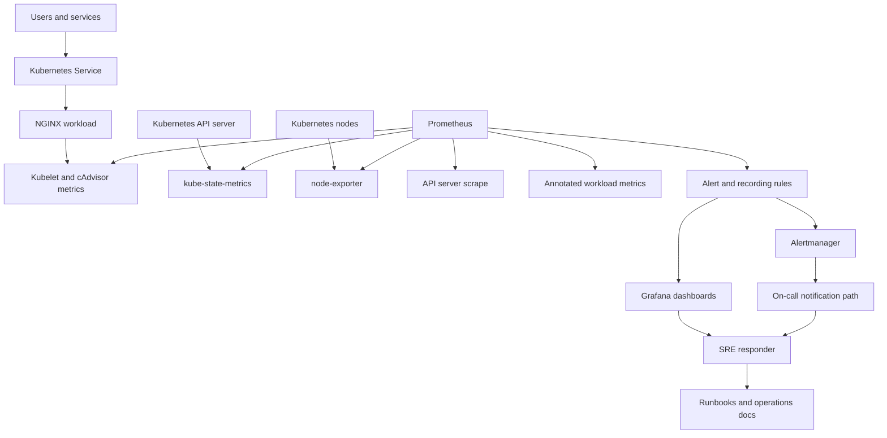
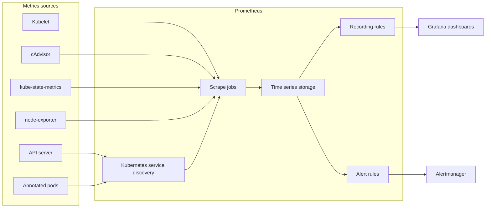
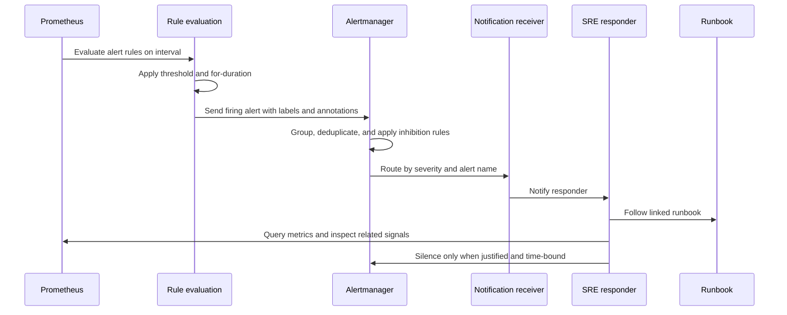
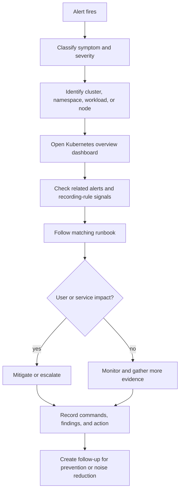
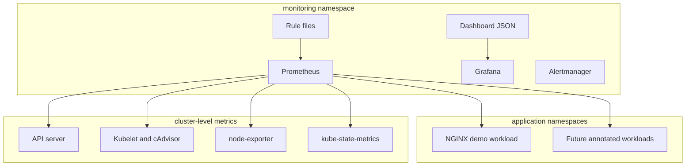

# Monitoring Architecture Diagrams

This document captures the Kubernetes monitoring stack architecture in reviewable Mermaid diagrams. The goal is to make data flow, alert flow, and responder workflow clear enough for another SRE to operate the stack without reverse-engineering every configuration file.

## System Context

### Operational Meaning

- Kubernetes exposes platform and workload state through the API server, kubelet, cAdvisor, kube-state-metrics, and node-exporter.
- Prometheus discovers targets through Kubernetes service discovery and evaluates alerting and recording rules.
- Grafana uses raw metrics and recording rules for incident investigation.
- Alertmanager receives firing alerts, groups related symptoms, inhibits lower-priority duplicates, and routes notifications.
- Runbooks convert alerts into repeatable investigation and mitigation steps.

## Prometheus Data Flow

### Implemented Configuration

| Concern | File | Notes |
| --- | --- | --- |
| Scrape configuration | `prometheus/prometheus.yml` | Defines Prometheus, API server, node, cAdvisor, and pod discovery jobs. |
| Alert rules | `prometheus/rules/kubernetes-alerts.yml` | Covers target health, node readiness, pod failures, deployment availability, and node saturation. |
| Recording rules | `prometheus/rules/recording-rules.yml` | Precomputes reusable cluster, node, namespace, and target health signals. |
| Dashboard | `grafana/dashboards/kubernetes-overview.json` | Uses Kubernetes and Prometheus metrics for first-response triage. |
| Alert routing | `alertmanager/alertmanager.yml` | Groups, inhibits, and routes alerts by severity and alert type. |

## Alert Lifecycle

### Alert Routing Expectations

- Critical alerts should reach an actively monitored on-call path.
- Warning alerts should reach the responsible team without unnecessary paging.
- Heartbeat or watchdog alerts should verify the notification path itself.
- A silence should include owner, reason, scope, and expiration.
- Recurring alerts should produce runbook or threshold follow-up work.

## Incident Investigation Workflow

### First Response Questions

| Question | Primary Surface |
| --- | --- |
| Is Prometheus missing data? | Target health panels and `PrometheusTargetDown`. |
| Is the node unhealthy? | Node readiness and resource saturation panels. |
| Is the workload unavailable? | Deployment availability, pod status, and restart panels. |
| Is this capacity related? | CPU, memory, filesystem, and pending pod signals. |
| Is this alert noisy or actionable? | Alertmanager route, runbook quality, and recent alert history. |

## Deployment Boundary

### Boundary Notes

- Monitoring components should run in a dedicated namespace, normally `monitoring`.
- Application workloads should remain in their own namespaces.
- Prometheus needs RBAC permissions for discovery and node proxy metrics.
- Secrets for notification receivers or external integrations must not be committed to this repository.
- Dashboard JSON and rule files should be reviewed like application code because they affect incident response behavior.

## Failure Modes Shown by the Architecture

| Failure Mode | Visible Symptom | Likely File or Surface |
| --- | --- | --- |
| Bad scrape configuration | Targets down or missing metrics | `prometheus/prometheus.yml` |
| Missing kube-state-metrics | Kubernetes state alerts never evaluate | Cluster add-on and Prometheus targets |
| Missing node-exporter | Resource saturation alerts never evaluate | Cluster add-on and Prometheus targets |
| Broken alert route | Alert fires but no notification arrives | `alertmanager/alertmanager.yml` |
| Dashboard query drift | Grafana panels show no data | `grafana/dashboards/kubernetes-overview.json` |
| Runbook drift | Responder cannot map alert to action | `runbooks/kubernetes-alerts.md` |

## Review Checklist

Before changing the monitoring architecture:

1. Confirm which production question the change answers.
2. Confirm the required metrics are available in Prometheus.
3. Confirm dashboards and alerts use stable labels.
4. Confirm critical alerts route to the intended receiver.
5. Confirm runbooks include triage commands and escalation criteria.
6. Validate Prometheus rule syntax before commit.
7. Update diagrams when data flow, routing, or ownership changes.
